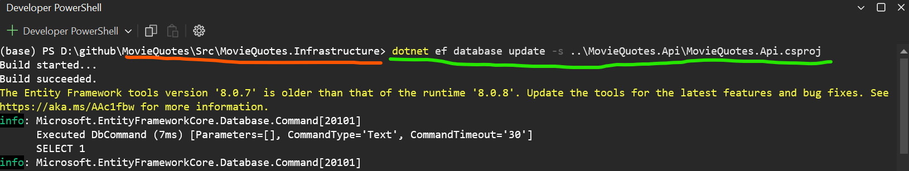

# Movie Quotes
in this project i will try to make personal copy of [playphrase.me][1] and see how it could be work.

i will use this copy of application in learning English/German languages (search for idioms or some specific word in movies)


## Main Idea
in this application there is two main section 
1. **population section**: we provide a video file (.mp4) along it's subtitle file (.srt) and the application will save them to database this will done through avalonia desktop application 
   
2. **Search section**: search for phrase/word in our database and then play it on the screen this will be through the client web application

structure will be look like the following


## Installation

1. we need to setup SqlServer and get a connection string to database similar to the following
   ```
   Server=localhost;Database=MovieQuotesDb;Trusted_Connection=True;TrustServerCertificate=True
   ```
2. update your connection string in AppSetting in [api project][5] and in the [UI Project][4]
3. open Terminal and install [Entity Framework Core tools][3]  `dotnet tool install --global dotnet-ef`
4. Navigate your Terminal to the location `.\Src\MovieQuotes.Infrastructure\` and write the following command
   ```
   dotnet ef database update -s ..\MovieQuotes.Api\MovieQuotes.Api.csproj
   ```
   which will create the database as following
   
5. Run the desktop application and populate the database
   ```
   dotnet run --project .\Src\MovieQuotes.UI\MovieQuotes.UI.csproj
   ```


[1]:  https://playphrase.me
[2]: https://avaloniaui.net/
[3]: https://learn.microsoft.com/en-gb/ef/core/cli/dotnet#installing-the-tools
[4]: https://github.com/ibram-reda/MovieQuotes/blob/c998380d594a228ee3aeaaeaae2c1e8d6ecedd36/Src/MovieQuotes.UI/Extensions/ServiceCollectionExtensions.cs#L34
[5]: https://github.com/ibram-reda/MovieQuotes/blob/c998380d594a228ee3aeaaeaae2c1e8d6ecedd36/Src/MovieQuotes.Api/appsettings.json#L11