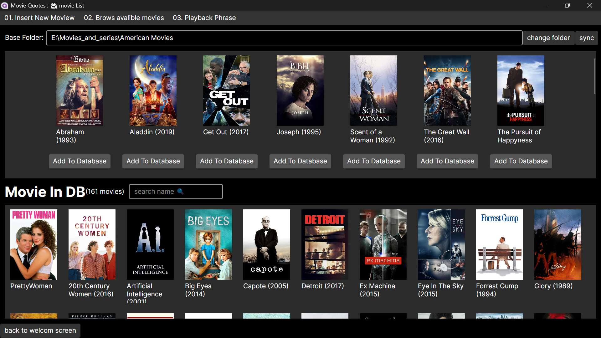
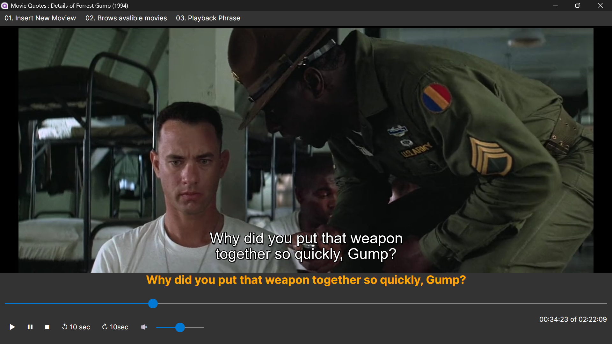
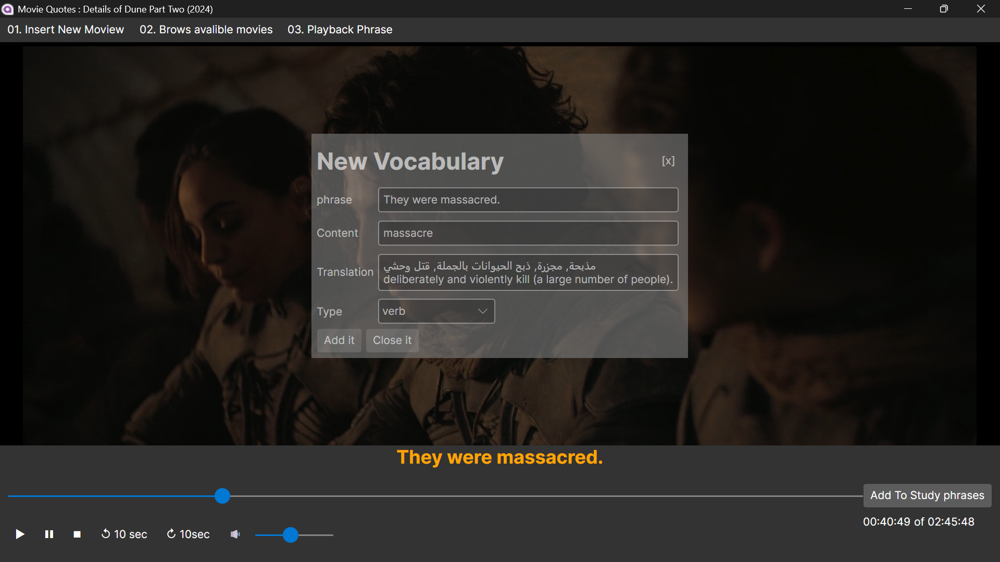
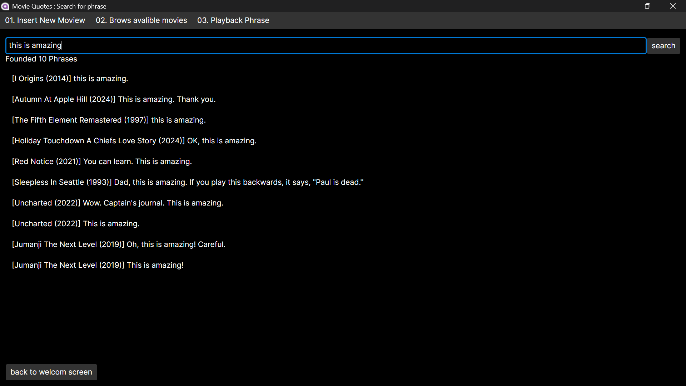
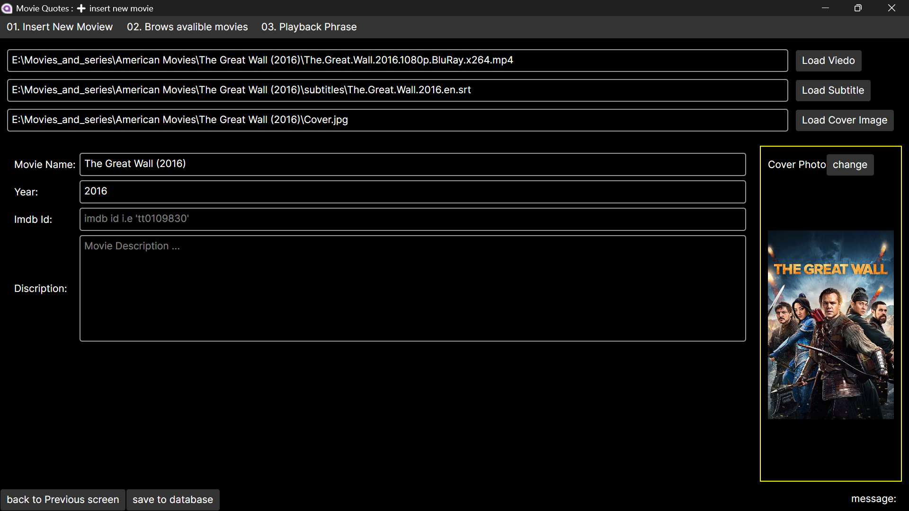

# Movie Quotes
in this project i will try to make personal copy of [playphrase.me][1] and see how it could be work.

i will use this copy of application to improve my languages and learning English/German languages (search for idioms or some specific word in movies)

## Screen Shoot from app











## Main Idea
in this application there is two main section 
1. **population section**: we provide a video file (.mp4) along it's subtitle file (.srt) and the application will save them to database.   
2. **Search section**: search for phrase/word in our database and then play it on the screen.
3. **watch section**: Watch the movie and save clips that have new terms and revision it latter.

## Installation
this application can work on any platform windows,linux,macos, and also can work with any DBMS i provide a [full detailed instruction to run it on Ubunto Linux 24.04](./installation-guide.md) with Mysql as a database
1. we need to setup a connection string 
   ```
   Server=localhost;Database=MovieQuotesDb;uid=root;pwd=root;
   ```
2. update your connection string in AppSetting in [api project][5] and in the [UI Project][4]
3. open Terminal and install [Entity Framework Core tools][3]  `dotnet tool install --global dotnet-ef`
4. Navigate your Terminal to the location `.\Src\MovieQuotes.Infrastructure\` and write the following command
   ```
   dotnet ef database update -s ..\MovieQuotes.Api\MovieQuotes.Api.csproj
   ```
5. Run the desktop application and populate the database
   ```
   dotnet run --project .\Src\MovieQuotes.UI\MovieQuotes.UI.csproj
   ```


[1]:  https://playphrase.me
[2]: https://avaloniaui.net/
[3]: https://learn.microsoft.com/en-gb/ef/core/cli/dotnet#installing-the-tools
[4]: https://github.com/ibram-reda/MovieQuotes/blob/c998380d594a228ee3aeaaeaae2c1e8d6ecedd36/Src/MovieQuotes.UI/Extensions/ServiceCollectionExtensions.cs#L34
[5]: https://github.com/ibram-reda/MovieQuotes/blob/c998380d594a228ee3aeaaeaae2c1e8d6ecedd36/Src/MovieQuotes.Api/appsettings.json#L11