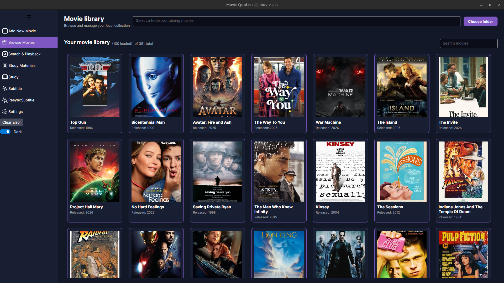
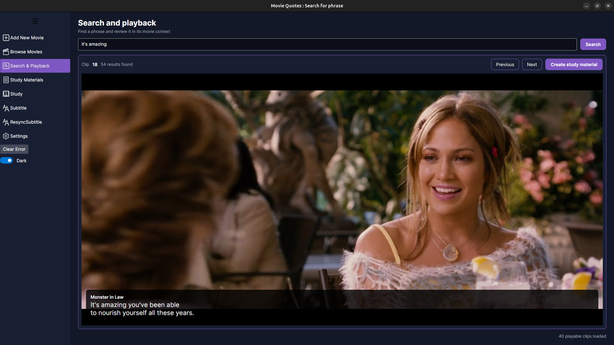
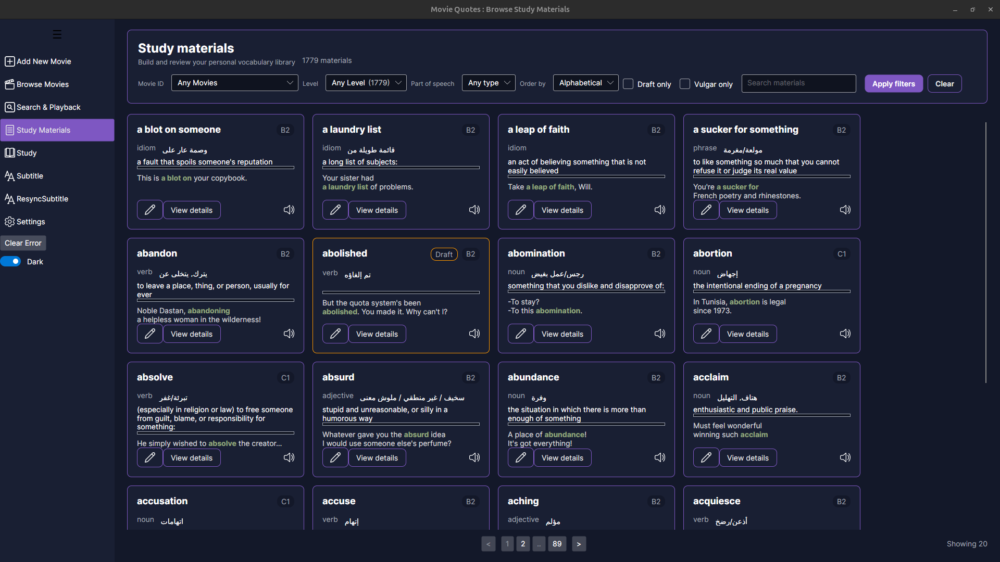
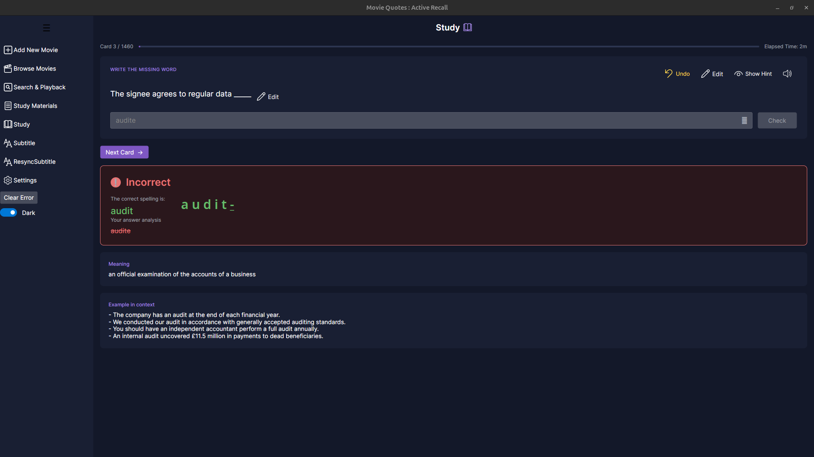

# 🎬 MovieQuotes

> **Where Movies Teach You to Speak**

MovieQuotes is a language-learning application that helps you **expand and memorize your vocabulary through movies**.

Instead of learning words and expressions in isolation, MovieQuotes lets you discover them in **real movie dialogue and context**, turn them into study materials, and practice them using **active recall**.

MovieQuotes currently focuses on **English**, with the goal of supporting **multiple languages** in the future.

## Screenshots

### Home



### Search

### Study Materials



### Active Recall



## How It Works

MovieQuotes is built around a simple idea:

> **Learn vocabulary from movies as it is actually used.**

Instead of starting with a vocabulary list, MovieQuotes starts with **movies and their dialogue**.

### The Learning Workflow

```text
        🎬 Watch a Movie
              │
              ▼
      💬 Discover Dialogue
              │
              ▼
       🔎 Find Useful Words
        & Expressions
              │
              ▼
       📚 Create Study
          Material
              │
              ▼
       🤖 Enrich & Understand
              │
              ▼
       🧠 Practice Active Recall
              │
              ▼
        🔁 Review & Remember
```

### 1. Discover

Watch movies and encounter words, expressions, idioms, and phrasal verbs that you want to learn.

### 2. Capture

Find the relevant phrase in the movie's subtitles and save it as study material.

This keeps the vocabulary connected to the **movie, dialogue, and context** in which you discovered it.

### 3. Enrich

Add the information you need to understand and learn the vocabulary, such as its meaning, translation, pronunciation, examples, synonyms, and language level.

MovieQuotes also provides an **AI assistant** that can suggest this information and help you build your study material faster.

### 4. Practice Active Recall

Use the Study page to actively retrieve the meaning and usage of your vocabulary instead of simply rereading it.

MovieQuotes currently provides different study exercises, including **Recognition** and **Context Recall**.

### 5. Review & Remember

MovieQuotes uses a **spaced repetition algorithm** to determine when study materials should be reviewed.

Your review history and answers influence future reviews, helping you focus on vocabulary that needs more practice while gradually strengthening what you already know.